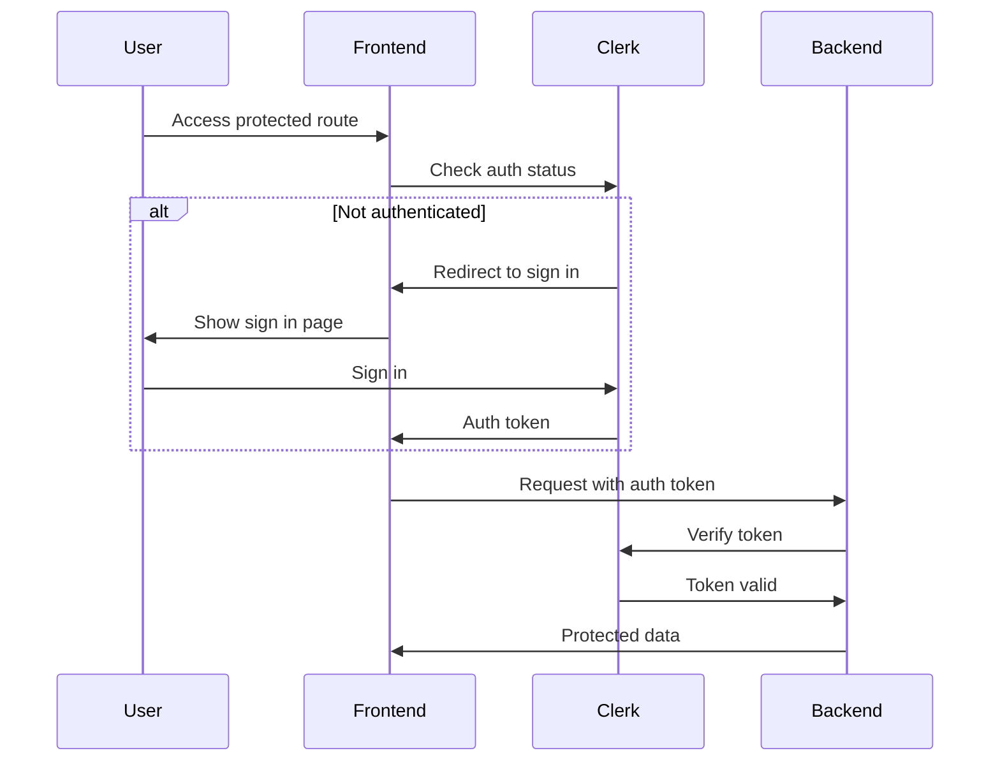

# Security Documentation

## Authentication

FormCraft uses Clerk for authentication, providing enterprise-grade security features and user management.

### Authentication Flow



### Clerk Integration

```typescript
// Middleware Configuration
export const middleware = withClerkMiddleware((req) => {
  return NextResponse.next({
    headers: {
      "x-organization-id": req.organization?.id ?? "",
      "x-user-id": req.auth?.userId ?? "",
    },
  });
});

export const config = {
  matcher: ["/((?!.+\\.[\\w]+$|_next).*)", "/", "/(api|trpc)(.*)"],
};
```

### Session Management

- JWT-based authentication
- Automatic token refresh
- Session invalidation
- Device management
- Activity logging

## Authorization

### Role-Based Access Control (RBAC)

```typescript
enum UserRole {
  ADMIN = "admin",
  MEMBER = "member",
  VIEWER = "viewer",
}

interface Permission {
  action: "create" | "read" | "update" | "delete";
  resource: "form" | "submission" | "integration" | "organization";
}

const rolePermissions: Record<UserRole, Permission[]> = {
  admin: [
    { action: "create", resource: "form" },
    { action: "read", resource: "form" },
    { action: "update", resource: "form" },
    { action: "delete", resource: "form" },
    // ... more permissions
  ],
  member: [
    { action: "create", resource: "form" },
    { action: "read", resource: "form" },
    { action: "update", resource: "form" },
    // ... limited permissions
  ],
  viewer: [
    { action: "read", resource: "form" },
    { action: "read", resource: "submission" },
    // ... read-only permissions
  ],
};
```

### Organization-Based Access

```typescript
interface OrganizationMember {
  userId: string;
  organizationId: string;
  role: UserRole;
  permissions: Permission[];
}

// Authorization middleware
const authorizeAction = async (
  req: AuthenticatedRequest,
  resource: string,
  action: string
) => {
  const { userId, organizationId } = req;

  // Check organization membership
  const member = await prisma.organizationMember.findUnique({
    where: {
      userId_organizationId: {
        userId,
        organizationId,
      },
    },
  });

  if (!member) {
    throw new UnauthorizedError("Not a member of organization");
  }

  // Check permission
  const hasPermission = member.permissions.some(
    (p) => p.resource === resource && p.action === action
  );

  if (!hasPermission) {
    throw new ForbiddenError("Insufficient permissions");
  }

  return true;
};
```

## Data Protection

### Encryption

1. **Data at Rest**

```typescript
// Database field encryption
model SensitiveData {
  id        String   @id
  data      Bytes    @encrypted // Encrypted using AES-256-GCM
  createdAt DateTime @default(now())
}

// Encryption service
class EncryptionService {
  private readonly key: Buffer;
  private readonly algorithm = 'aes-256-gcm';

  constructor() {
    this.key = Buffer.from(process.env.ENCRYPTION_KEY!, 'base64');
  }

  encrypt(data: string): EncryptedData {
    const iv = crypto.randomBytes(12);
    const cipher = crypto.createCipheriv(this.algorithm, this.key, iv);

    const encrypted = Buffer.concat([
      cipher.update(data, 'utf8'),
      cipher.final(),
    ]);

    const tag = cipher.getAuthTag();

    return {
      iv: iv.toString('base64'),
      data: encrypted.toString('base64'),
      tag: tag.toString('base64'),
    };
  }

  decrypt(encryptedData: EncryptedData): string {
    const decipher = crypto.createDecipheriv(
      this.algorithm,
      this.key,
      Buffer.from(encryptedData.iv, 'base64')
    );

    decipher.setAuthTag(Buffer.from(encryptedData.tag, 'base64'));

    return (
      decipher.update(
        Buffer.from(encryptedData.data, 'base64'),
        undefined,
        'utf8'
      ) + decipher.final('utf8')
    );
  }
}
```

2. **Data in Transit**

- TLS 1.3 for all connections
- HSTS enabled
- Secure cookie configuration
- Content Security Policy

### File Security

```typescript
// File upload security
const fileUploadConfig = {
  maxSize: 10 * 1024 * 1024, // 10MB
  allowedTypes: ["image/jpeg", "image/png", "application/pdf"],
  scanForMalware: true,
  storageConfig: {
    bucket: process.env.AWS_BUCKET_NAME,
    encryption: {
      serverSideEncryption: "AES256",
    },
    acl: "private",
    expires: 3600, // 1 hour signed URLs
  },
};

// Virus scanning middleware
const scanFile = async (file: Express.Multer.File) => {
  const scanner = new ClamAV();
  const result = await scanner.scanStream(file.buffer);

  if (result.isInfected) {
    throw new SecurityError("Malware detected");
  }

  return file;
};
```

## API Security

### Rate Limiting

```typescript
// Rate limiting configuration
export const rateLimiter = rateLimit({
  windowMs: 15 * 60 * 1000, // 15 minutes
  max: 100, // Limit each IP to 100 requests per windowMs
  message: "Too many requests from this IP",
  standardHeaders: true,
  legacyHeaders: false,
});

// API-specific limits
const apiLimits = {
  "POST /api/forms": {
    windowMs: 60 * 1000, // 1 minute
    max: 5,
  },
  "POST /api/submissions": {
    windowMs: 60 * 1000,
    max: 10,
  },
};
```

### Request Validation

```typescript
// Input validation using Zod
const FormSchema = z.object({
  title: z.string().min(1).max(100),
  fields: z.array(
    z.object({
      type: z.enum(["text", "number", "email"]),
      label: z.string(),
      required: z.boolean(),
    })
  ),
  settings: z.object({
    submitButton: z.string(),
    successMessage: z.string(),
  }),
});

// Validation middleware
const validateRequest = (schema: z.ZodSchema) => {
  return async (req: Request, res: Response, next: NextFunction) => {
    try {
      await schema.parseAsync(req.body);
      next();
    } catch (error) {
      res.status(400).json({
        error: "Validation failed",
        details: error.errors,
      });
    }
  };
};
```

## Security Headers

```typescript
// Security headers middleware
const securityHeaders = {
  "Content-Security-Policy":
    "default-src 'self'; script-src 'self' 'unsafe-inline' 'unsafe-eval'; style-src 'self' 'unsafe-inline';",
  "Strict-Transport-Security": "max-age=31536000; includeSubDomains",
  "X-Frame-Options": "DENY",
  "X-Content-Type-Options": "nosniff",
  "X-XSS-Protection": "1; mode=block",
  "Referrer-Policy": "strict-origin-when-cross-origin",
  "Permissions-Policy": "camera=(), microphone=(), geolocation=()",
};
```

## Audit Logging

```typescript
interface AuditLog {
  id: string;
  timestamp: Date;
  userId: string;
  organizationId: string;
  action: string;
  resource: string;
  resourceId: string;
  changes: Record<string, any>;
  metadata: {
    ip: string;
    userAgent: string;
    location?: string;
  };
}

// Audit logging service
class AuditLogger {
  async log(event: Omit<AuditLog, "id" | "timestamp">) {
    await prisma.auditLog.create({
      data: {
        ...event,
        timestamp: new Date(),
      },
    });
  }

  async query(filters: Partial<AuditLog>) {
    return prisma.auditLog.findMany({
      where: filters,
      orderBy: { timestamp: "desc" },
    });
  }
}
```

## Security Best Practices

1. **Authentication**

   - Enforce strong passwords
   - Implement MFA
   - Regular session cleanup
   - Secure password reset flow

2. **Authorization**

   - Principle of least privilege
   - Regular permission audits
   - Resource-level access control
   - Organization isolation

3. **Data Protection**

   - Regular security audits
   - Data classification
   - Encryption key rotation
   - Secure backup strategy

4. **API Security**

   - Input validation
   - Output sanitization
   - Rate limiting
   - Error handling

5. **Monitoring**
   - Security event logging
   - Anomaly detection
   - Regular security scans
   - Incident response plan
